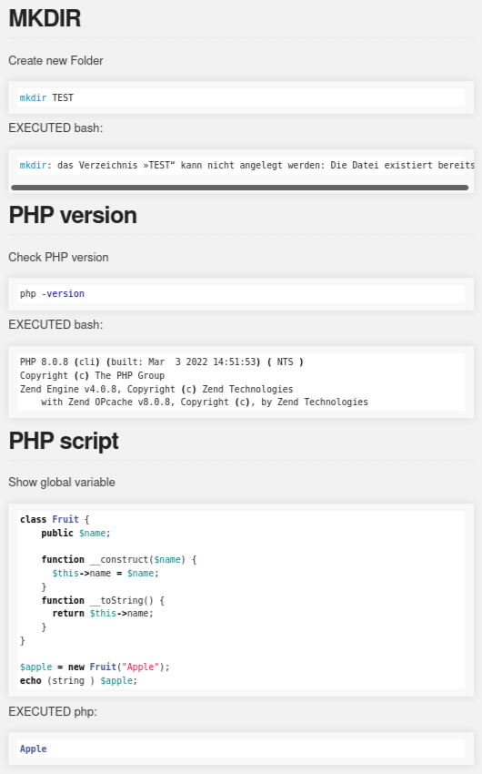

# [Usecases - examples.plainedit.com](http://examples.plainedit.com/) [<span style='font-size:20px;'>&#x270D;</span>](https://github.com/plainedit/examples/edit/main/DOCS/MENU.md)

+ [Sourcecode - bash.plainedit.com](http://bash.plainedit.com/)
+ [Documentation - docs.plainedit.com](http://docs.plainedit.com/)
+ [Website - www.plainedit.com](http://www.plainedit.com/)
+ [News - blog.plainedit.com](http://blog.plainedit.com/)
+ [Offer - offer.plainedit.com](http://offer.plainedit.com/)
+ [Roadmap - offer.plainedit.com](http://roadmap.plainedit.com/)
+ [logo.plainedit.com](https://logo.plainedit.com/)


## Install [<span style='font-size:20px;'>&#x270D;</span>](https://github.com/plainedit/examples/edit/main/DOCS/INSTALL.md)

Install from repo: https://github.com/plainedit/bash.git
```bash
./install.sh
```

Update works such git pull for bash repo: https://github.com/plainedit/bash.git
```bash
./update.sh
```

clean folders from temp files
```bash
./clean.sh
```


## START [<span style='font-size:20px;'>&#x270D;</span>](https://github.com/plainedit/examples/edit/main/DOCS/START.md)


The same, with folders
```bash
./plainedit "1/in.md" "1/out.md" 
```

The same, with folders
```bash
./plainedit "1/in.md" "1/out.md" 
```

Config Path where the project folder exist, PlainEdit can be executed from another bash script with defined path

It works here
```bash
./plainedit --path "/media/tom/projects/plainedit/examples/1" "in.md" "out.md"
```

Authorisation
```bash
./plainedit "1/in.md" "1/out.md" "1/auth.md"
```

## PROJECTS [<span style='font-size:20px;'>&#x270D;</span>](https://github.com/plainedit/bash/edit/main/DOCS/PROJECTS.md)

Working with projects structure folder

files structure
```
1
    in.md
    out.md
2
    in.md
    out.md
```


Start Project no 1
```bash
./plainedit.sh 1
```

Start Project no 2
```bash
./plainedit.sh 2
```


## FLAGS [<span style='font-size:20px;'>&#x270D;</span>](https://github.com/plainedit/bash/edit/main/DOCS/FLAGS.md)

### show only code
example with FLAGS
+ [IN ](../1/in.md)
+ [OUT ](../1/out.md)

### show only code at selected script
example with FLAGS
+ [IN ](2/in.md)
+ [OUT ](2/out.md)


## EXAMPLES [<span style='font-size:20px;'>&#x270D;</span>](https://github.com/plainedit/examples/edit/main/DOCS/EXAMPLES.md)




+ [examples.plainedit.com](http://examples.plainedit.com)
+ [1 # Test 1](http://examples.plainedit.com/1)
+ [2 # Test 2](http://examples.plainedit.com/2)


## DOCS [<span style='font-size:20px;'>&#x270D;</span>](https://github.com/plainedit/examples/edit/main/DOCS/DOCS.md)

Jak pracować z dokumentacją?


combine, publish, open browser

```bash
./readme.sh
```


## TODO [<span style='font-size:20px;'>&#x270D;</span>](https://github.com/plainedit/examples/edit/main/DOCS/TODO.md)

+ we are waiting for suggestions

more on [Roadmap - offer.plainedit.com](http://roadmap.plainedit.com/)


---

+ [edit](https://github.com/plainedit/examples/edit/main/README.md)
+ [plainedit/examples](https://github.com/plainedit/examples)
+ [LICENSE](LICENSE)

